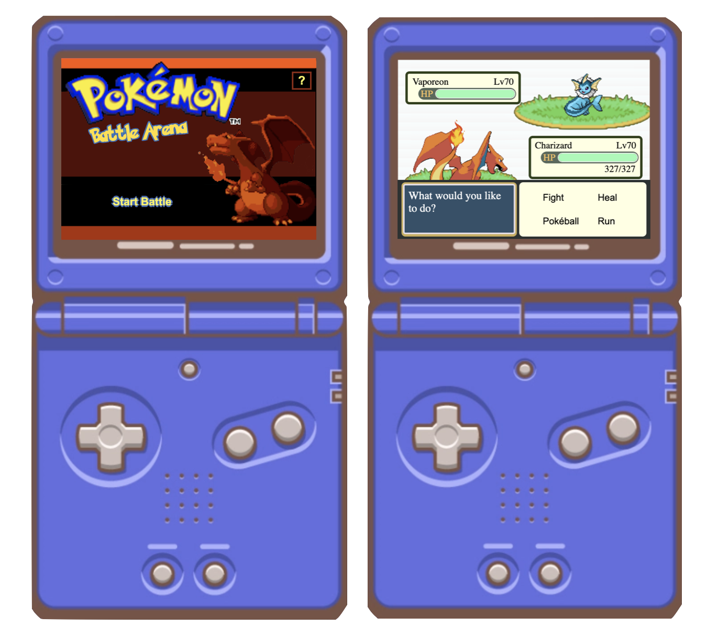

# Pokemon Battle Arena

The Pokemon Battle Arena is a web-based app that simulates Pokemon battles with randomly generated opponents from generation 1. It is built using Vanilla JavaScript, HTML, and CSS. It utilizes the PokeAPI to fetch Pokemon data.

## [Live Demo](https://manielsen13.github.io/pokemon-battle-arena/)

Check out the live version of the project [here](https://manielsen13.github.io/pokemon-battle-arena/). Enjoy!

## How to Play

Click the options on the gameboy's screen to start the battle, select actions, and select moves. Run away to quit the battle or perform moves until either Charizard or the opponent faint.

## Battle System

The Pokémon Battle Arena implements a slightly different battle system compared to traditional Pokémon battles in the games. Here are some aspects that differ from the original game mechanics:

- **Streamlined Battle Mechanics**: The battle mechanics in the simulator focus on key aspects such as move effectiveness, critical hits, resistance, and immunity. Speed, health, and levels (between a given range 66-74 for enemies, and Charizard's level is fixed) are randomly assigned when the battle is loaded. Each trainer is given 3 potions. Base damage is calculated using basic attack and defense stats. This simulator doesn't implement EVs, IVs, Sp. Attack, or Sp. Defense stats. There are no status effects, buffs, or debuffs. Moves are single turn. Overall, it provides a condensed experience of the Pokémon battle system while still maintaining strategic elements.

- **Randomly Generated Opponent**: Instead of battling against pre-designed trainers, the simulator generates random opponents with Pokémon fetched from the PokeAPI. This adds an element of surprise and variety to the battles.

- **Move Selection**: The simulator currently provides a limited move selection for both the user and the opponent Pokémon. Moves are single-turn moves that don't cause status effects, buffs, or debuffs. The user can choose from Charizard's predefined set of moves during their turn, while the opponent trainer selects a move at random. The app aggregates all learnable valid moves by the opposing pokemon to create the opponent's move pool.

- **Announcer System, Item System, and Pokeballs**: For UX purposes, you can heal directly in battle by using a potion rather than having to open your bag. There's a throw pokeball action option, although this is just for show (you can try, but you can't catch an opposing trainer's pokemon). The text and announcements during the battle are tailored to fit the features of the app rather than match the original game.

## Architecture, Design, and File Descriptions

The project follows a modular architecture, separating different concerns into individual files. The key components of the battle system, such as the battle conductor, user interface controller, announcer, and Pokémon-related classes, are organized into separate files, promoting code modularity and maintainability.

The project consists of the following files:

- **battle_announcer.js**: This file contains the `BattleAnnouncer` class manages the battle announcements and updates. It displays messages in the announcer box and provides prompts to guide the user through the battle. The announcer system enhances the battle experience by providing real-time feedback and engaging the user with relevant information.

- **battle_conductor.js**: The `BattleConductor` class in this file orchestrates the flow of the battle, determining the order of turns, handling user and CPU actions, and checking for battle end conditions.

- **battle_loader.js**: In `battle_loader.js`, you'll find the `BattleLoader` class responsible for initializing the battle by creating trainers and loading battle assets.

- **battle_ui_controller.js**: This file contains the `BattleUIController` class, which handles the user interface elements and interactions related to the battle.

- **battle_utils.js**: The `battle_utils.js` file provides utility functions used in the battle system, such as calculating damage and checking move effectiveness.

- **game_data.js**: This file contains the game data, including Pokémon information and move sets.

- **menu_ui_controller.js**: The `MenuUIController` class in `menu_ui_controller.js` manages the game menu user interface, allowing players to navigate through different options.

- **pokemon.js**: `pokemon.js` defines the `Pokemon` class, representing a Pokémon in the game. It includes properties and methods related to Pokémon attributes, moves, and status.

- **trainer.js**: In `trainer.js`, the `Trainer` class is defined, representing a trainer in the game. It encapsulates a Pokémon owned by the trainer and provides methods for actions such as using moves and items.

- **index.html**: This is the main HTML file that serves as the entry point for the application. It includes the necessary HTML structure and references the required CSS and JavaScript files.

- **styles.css**: The `styles.css` file contains the CSS styles responsible for the visual appearance and layout of the game interface.

- **index.js**: The `index.js` file serves as the entry point for the JavaScript code. It initializes the game and sets up event listeners.

## Dependencies

The Pokemon Battle Simulator relies on the following dependencies:

- PokeAPI: Provides the Pokemon data used in the battles. The application fetches data from the PokeAPI using JavaScript's `fetch` function.

## How to Run

There is a link to the live app at the top of this file. If you want to run it yourself, clone the repo or download the files and run the application on a live server (to prevent CORS error).
